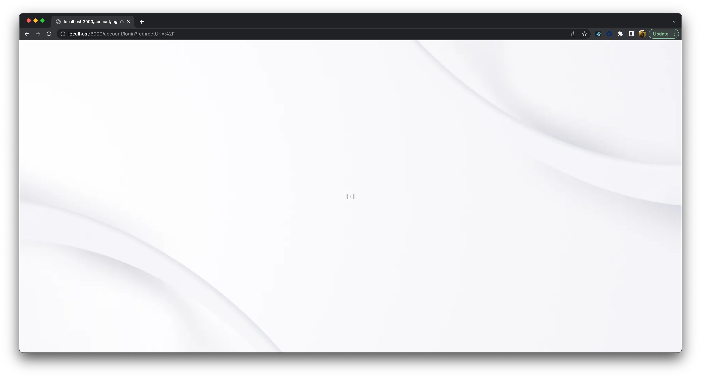

## Blank login screen reproduction

Steps to reproduce:

1. Configure the following ENV vars accordingly

   ```
   # The AppUrl you set during integration - this is to tell Frontegg your application hostname
   FRONTEGG_APP_URL=

   # The Frontegg domain is your unique URL to connect to the Frontegg gateway
   FRONTEGG_BASE_URL=

   # Your Frontegg application's Client ID
   FRONTEGG_CLIENT_ID=
   ```

2. `npm run dev`
3. Login as normal
4. Click the "Click me" link a few times. Notice how it navigates between two pages `/` and `/test`
5. Open the browser dev console and delete all cookies (mimicking an expired session)
6. Click on the "Click me" link again
7. Observe the bug:


